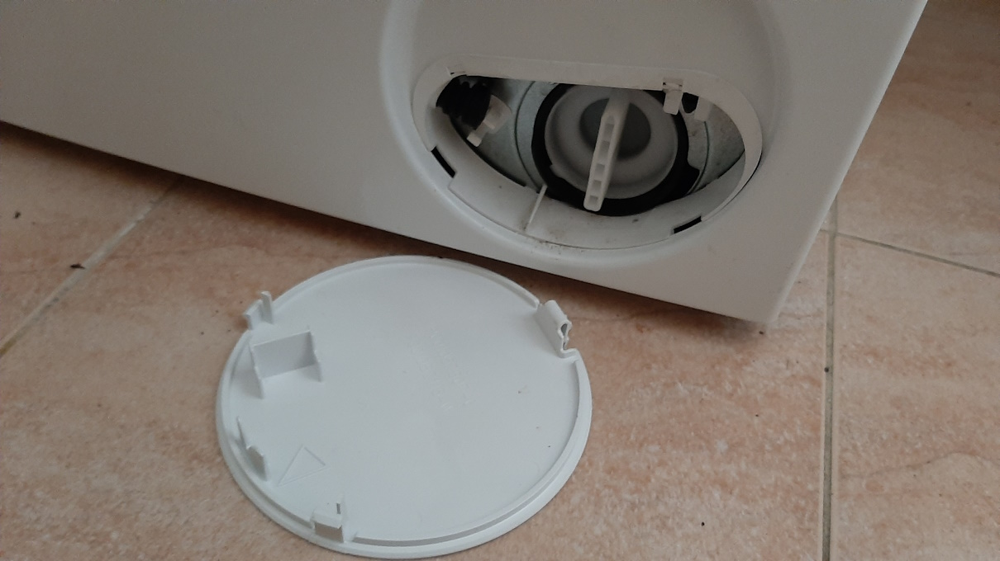

# Navodila

## Mojstri

Moji prijatelji so mojstri in bodo poskrbeli, če bo kaj potrebno.  
Za elektriko Andrej: 070 224 200  
Za vodo Aljoša: 031 636 977  
Za klimo Rok: 031 613 725  
Kot hišnik Alan: 040 752 669  

## Štedilnik

Na štedilniku na steklo-keramični plošči so komande na dotik.  
Če se izpiše črka "H" to pomeni, "hot", ker je plošča še nekaj časa vroča po uporabi in se ne sme na njo nič postaviti.  
  
Za čiščenje steklo-keramike se uporablja strgalo za steklo za odstranitev velike umazanije. Nato se polira s posebnim čistilom za steklo-keramiko.  
Nastavitev ure, ko se resetira, ker je zmanjkalo elektrike:  
  
Priročen enostaven timer, ko se kuha. Ko se konča nastavljen čas začne piskati.  
  

## Kopalnica

Kopalnica mora imeti večino časa odprto okno na ventus. Če je okno dolgo časa zaprto se začne nabirati vlaga in začne smrdeti po vlagi. To ni ne dobro ne zdravo.  
Mi smo zapirali okno v kopalnici malo preden smo se šli tuširati. Po tuširanju pa smo ga odprli, da gre para ven. Tudi sušilni stroj naredi veliko vlage in ta mora nekam ven.  

## Pralni stroj

Pralni prašek ali tekočina gre v najbolj levo posodico (za normalno pranje).  
  
Jaz najraje nastavim na Schnell/Mix leise (šest pozicij levo) in potem se dotaknem Start(skrajno desno).  
  
Spodaj desno je filter, ki ga treba bolj redko očistiti, recimo dvakrat letno.  

Pri temu je treba paziti, ker se bo izlilo en liter vode. Prvo se spusti en del vode iz cevke.  

Preden se odpre filter se podstavi ena nizka posoda (krožnik) in krpa, ker bo steklo še nekaj vode.  
  

## Sušilni stroj

Sušilni stroj je potrebno bolj pozorno čistiti, ker so vsi filtri zelo občutljivi, narejeni iz tenke plastike in se takoj kaj razdre, razbije ali polomi.  
Super pomembno je pred VSAKO uporabo:

1. sprazniti vodo gor levo
2. počistiti oba dva filtra znotraj bobna! Nežno jih je treba odpreti, da se ne poškodujejo.  
3. obstaja še tretji filter, ma tega se čisti bolj poredko, recimo enkrat na dva meseca. Ta je levo spodaj za vratci.

Jaz nastavim na Mix (5 pozicij desno) ali na prejšnjo Towel in potem dotaknem Start (skrajno desno).  
  

Odvečna voda se nabira zgoraj levo v posebnem rezervoarju. Tega se izvleče ven (je zelo dolg).  
  
Na koncu ima luknjo iz katere se voda izlije v lijak. Malo je potrebno obračati, da gre vsa voda ven.  
  
Prvi filter se izvleče vertikalno.  
  
Se ga odpre in nežno pobere cofke. Najlažje je narediti kepico vlaken in z njo pobrat vse ostalo.  
  
Nato se iz istega mesta izvleče drugi filter.  
  
Na isti način se ga odpre in pobere ostanke.  
  
Tesnilo znotraj stroja se tudi počisti od ostankov. Zdaj se lahko vrne filter 1 in filter 2 nazaj na svoje mesto.

Filter 3 se počisti bolj redko na dva meseca. Vratca levo spodaj se odprejo.  
  
Zapiralne kljukice se obrnejo v horizontalni položaj.  
  
  
Filter3 se vodoravno izvleče.  
  
Filter se povleče ven iz ohišja.  

Če je malo umazan, se filter potolče, da prah pade ven. Če je močno umazan se ga opere pod vodo in pusti posušit do konca.  

Nato se filter3 vrne nazaj v obratnem zaporedju, kot je bil vzet ven.  

## Klima

Klima Mitsubishi hladi poleti in greje pozimi.  
Pri hlajenju je boljše, da piha navzgor, ker mrzli zrak gre sam navzdol.  
Pri gretju je boljše, da piha navzdol, ker topli zrak gre sam navzgor.  
Klima je zadosti močna, da greje dnevni prostor, ampak ne uspe greti/hladiti še dve spalnici.  
Filtre od klime se enostavno počisti enkrat na mesec.  
Klimo je treba servisirati na dve leti.  

## Peč na drva

V izjemno mrzlih dveh do treh tednih pozimi je klima premalo. Takrat uporabimo kaminsko peč na drva. Prvo odstranimo vse kar je na peči ali dimniku, ker bo postalo zelo vroče.  
Drva so zložena na balkonu. Pri zlaganju drv je potrebno dati debel karton na zid, da se ne poškoduje fasada, ki je lep "špatolato" in se hitro poškoduje, ter se ga ne da lepo popravljati.  
Poleg drv, uporabljamo še brikete in kocke za vžig. Pri delu s pečjo jaz vedno uporabljam usnjene rokavice, da se ne spečem in da me drva ne porežejo.  
Pred uporabo je treba iz notranjosti peči očistiti in odstraniti pepel. Pepel je lahko še vroč, zato je dobro, da se ga spravi v en kovinski lonec. Ko se ga nabere in se ohladi, se pretrese v vrečo za smeti in nese v smeti.  
Moj postopek za vžig peči je, da brikete "razrežem" na tenke rezine.

  
  

Vrata podprem z palico tako da okrogli del zagozdim v peč, drugi del drži vrata.

Odprem zrak na peči: spodnjo ročico izvlečem koliko se da, zgornjo ročico dam na desno. Na rešetko postavim eno rezino. Na njo kocko za vžig. Potem z ostalimi rezinami naredim šotor. Z dolgim vžigalnikom takoj vžgem.

Nato okoli "šotora" pozorno dodam 4 četrtine briketov. Ne smemo dati celoten briket, ker se ta zelo podaljša in začne pritiskati na steklo. Brikete vedno razdelim na četrtine. Potem nad vse to dodamo dva srednja drva. Pri temu pazimo, da se šotor ne zruši. S prakso to postane zelo enostavno.

Zapremo vrata in čakamo, da se vse vžge. Jaz takrat rad gledam v ogenj, ker to pomaga, da boljše zagori. Malo po malo zapiram spodnji zrak tako, da ročico pritiskam na noter. Zgornjega puščam odprtega.

Ko je vse zelo vroče lahko dodamo še dva drva. Takrat lahko spodnji zrak zapremo popolnoma.  
Ko drva izgorijo do polovice spet dodamo dva drva in tako naprej. Zdaj lahko tudi zgornji zrak začnemo počasi zapirati. Običajno imamo zgornji zrak nekje na pol, odvisno kako mrzlo je.

Ko se peč močno segreje potem odpremo še vrata od spalnic, da se temperatura razširi po celem stanovanju.

Pozor pri uporabi metlice za peč, ker so ščetine iz plastike in se hitro raztopijo, če je peč vroča. Uporabljajte to metlico samo na hladno peč.  

## Bojler

Bojler smo pred kratkim zamenjali (2023). Je nov. Ampak žal naredi nek škripav zvok vsakič, ko se pritisk mrzle vode hitro zmanjša npr. ko se hitro odpre mrzla voda, ko se odplakne WC, ko pralni stroj odpre mrzlo vodo. To ni nič kritičnega, je samo zoprno. Pričakujem, da se bo to sčasoma zmanjšalo.  
Če se počasi odpre mrzla voda ali se odpre mešana topla in mrzla, tega zvoka ne naredi.  
Zaenkrat je bojler nastavljen na 40°, da voda ne bi bila prevroča. To se enostavno spremeni s tipkami plus ali minus.  
Bojler ima vgrajeno zaščito proti legioneli. Vsak mesec samo enkrat samodejno poveča temperaturo vode na 60°C. To je dobro vedeti, da nas ne preseneti nepredvideno vroča voda.  

## Tuš

Pipa za tuš je termostatska. Levi kontrolnik določa moč curka, desni kontrolnik pa želeno temperaturo mešanja vode.  
Včasih se naberejo lasi v odtoku in slabo požira. Takrat uporabimo "gumijasto orodje". Iz mojih izkušenj cevosan ni deloval prav nič.  
Orodje nežno pritisnemo na odprtino od odtoka in potem malo bolj energično povlečemo. Takrat bo iz odtoka skočila ven umazanija. Potrebno jo je ujeti preden spet zbeži v odtok. Včasih je potrebno ponoviti večkrat to "odpumpavanje".  

## Kotliček

Zraven kotlička je "boom gun", mali tuš. To uporabljajo v Aziji za higieno po uporabi WC školjke. Tam sta dva ločena ventila: en je za kotliček in drugi ločeni za "boom gun".  

## Glavni ventil za vodo

V kopalnici pod bojlerjem 20 cm od tal je glavni ventil za vodo za stanovanje. Tega se zapre, če je kakšna okvara na vodovodni instalaciji in se to popravlja.  

## Hladilnik

Hladilnik je nastavljen na 8°C. Kontrolnik je na vrhu hladilnika.  
Na zadnji steni hladilnika se kondenzira voda in odteka skozi luknjica na hrbtno stran hladilnika nad kompresor. Ta je topla in tako ta voda izhlapi.  
Včasih se ta luknjica zaštopa zaradi umazanije. To se opazi tako, da se hladilnik težko odpira, ker se v njemu naredi podtlak.  
Takrat je zadosti z eno žičko malo pobrskati luknjo, da voda spet steče ven.  
Normalno je da tu pa tam hladilnik dela neke čudne zvoke: piska, škripa, krcka itd. Važno je da to ni non-stop, ampak samo tu-pa-tam.

## Zamrzovalnik

Spodnji del hladilnika je zamrzovalnik. Zelo pomembno je, da se spodnja vrata vedno dobro zaprejo. Jaz sem navajen, da prvo zaprem z roko vrata in potem nežno z nogo pritisnem, da tudi spodnji del vrat lepo zapre.  
V primeru, da vrata niso dobro zaprta, pride vlaga v zamrzovalnik in naredi veliko ledu. Res veliko. Takrat zamrzovalnik ne more več pravilno delati. Sčasoma se pokvari in hrana v njemu in kompresor od hladilnika.  
Takrat je potrebno zamrzovalnik odtaliti in odstraniti odvečni led.  
Prvo je treba paziti na parket. Ko se bo led odtalil bo naredil veliko vode. Če to vodo pustimo na parket, se bo ta napihnil in dvignil. To je uničen parket in ni mu več rešitve.  
Vedno pod zamrzovalnik damo krpe in posode tako, da voda NE pride do parketa.  
Praktično je večje kose ledu z leseno žlico nežno odlepiti od sten. Ne sme se uporabljati železno orodje, ker bo to zelo verjetno prebilo tenko steno, plin bo zbežal in tako poškodbo ni možno več sanirati. Zamrzovalnik ne bo več deloval.

## Televizorji

Oba televizorja so nastavljena, da prejmejo signal preko HDMI kabla. Na ta kabel se enostavno poveže računalnik in tako se televizor uporablja kot monitor od računalnika.  
Za udobno delovanje iz kavča bom pustil brezžično tipkovnico Logitech.  
Daljinca od televizorja se sploh ne uporablja, ker se vse upravlja iz računalnika.  

## Varovalke

Na hodniku je omarica z varovalkami. Če pride do kratkega stika ali kratkoročne prevelike porabe elektrike bo varovalka "padla dol".  
Ko se odpravi vzrok tega stika, se stikalo od varovalke pomakne gor.  
Notri v omarici je približen seznam katere varovalke kaj varujejo.  

## Parket in laminati

Parket in laminat so občutljivi na vodo. Če se voda polije, jo je treba takoj posušiti. Voda hitro povzroči, da se parket in laminat napihnejo in dvignejo. To se potem nikoli ne vrne v originalne dimenzije in je tlak pokvarjen in ga je treba zamenjati.  
Isto velja tudi pri čiščenju. Parket in laminat se čistijo z rahlo vlažno krpo. Nikako ne z veliko vode, kot se običajno čistijo ploščice. Te namreč niso občutljive na vodo.  
Ampak tudi pri ploščicah se ne sme kar polivati z vodo, ker odteče med fugami v tlak in potem se naredi flek sosedu na stropu ali na zidu.  

## Vhodna vrata

Vhodna vrata v stavbo so vedno zaprta. Lahko se od zunaj odprejo z elektronskim obeskom ali s ključem.  
Iz znotraj se lahko odprejo vrata s gumbon na domofonu, ampak samo, če je nekdo že pozvonil na zvonec "Furlan".  
Če se vhodna vrata potisnejo do konca, tam ostanejo. To je priročno, ko nosimo stvari. Potem samo malo povlečemo in se bodo samodejno zaprla s pomočjo hidravličnega zapirala.  

## Vrata na skupni hodnik

Vrata na skupni hodnik, ki ga delimo s sosedom so načeloma vedno zaklenjena ponoči in ko nismo doma. Če smo doma jih pogosto pustimo odklenjena, da gosti lažje pridejo.  
Ampak ta vrata lahko sosed kadarkoli zaklene, recimo ko gre ven. Zato moramo imeti ključ vedno pri sebi, ko gremo ven, da ne ostanemo zaklenjeni zunaj.  
