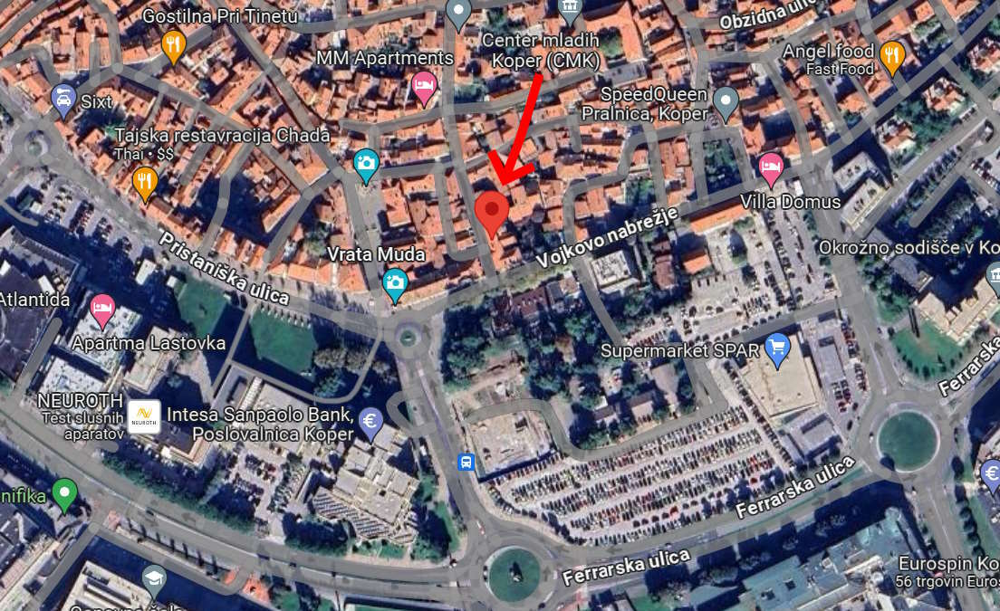

# Stanovanje Furlan

<https://bestia.dev/stanovanje>

Stanovanje je na prvem nadstropju dvonadstropne stavbe na Soški ulici 5, Koper na robu starega mestnega jedra v bližini Levja Vrata Muda in Vojkovega nabrežja.  
<https://maps.app.goo.gl/AXh9bd6sYDkzie7R7>

  

Na eni strani stanovanja pokrit odprt balkon gleda na kuhinjo od vrtca. Na nasprotni strani dva okna gledajo na Soško ulico.  
Stanovanje je veliko 59m2, ima dve ločene "spalnice", dnevni prostor s kuhinjo, kopalnico in balkon. Nima kleti ali podstrešja.  

## Slike

[Mapa s slikami](slike.md)

## Parking

Na oddaljenosti 250m je plačljivo parkirišče Grafist (na makadamu) za 25€ na mesec.  
Parkirišča:

- parkirišče Grafist 250m  
- Parkirišče za Banko Koper 400m  
- Garažna hiša - podzemna 260m

[Slike parking](parking.md)

## Oprema

Stanovanje je bilo renovirano leta 2006.  
Tri okna in balkonska vrata so zamenjana s plastičnimi z dvojnim steklom. Ko se zapre se nič ne sliši in dobro termično izolirajo.  
Od opreme so hladilnik (2014), TV panasonic 50" (2014), TV Samsung 42" (2006), Mitsubishi klima (2010), pralni stroj Bosch (2022), sušilni stroj Bosch (2017),
steklo-keramični štedilnik Gorenje (2006), kaminska peč (2008), bojler (2023), el. grelec Glamox (2006).  

V spalnici je velika zakonska postelja. V dnevni sobi in v sobi za goste imamo 2 klik-klak kavča Ikea, ki se odprejo v udobno posteljo za dva.  
Po želji lahko pustimo nekaj kuhinjske opreme: kozarci, krožniki, lonci,...  

## Cena

Stanovanje damo v najem za 750 EUR/mesec.  
Da poudarim, da od tega gre 25% oziroma 187,50€ direktno državi za davke. Torej je dejansko najemnina 562,50€, ostalo gre državi.  
<https://www.fu.gov.si/zivljenjski_dogodki_prebivalci/oddajam_sobo_stanovanje_hiso_garazo_v_najem/>  
Varščina je 2 mesečna plačila. To vrnemo na koncu najemu. Če na koncu najema nastanejo nepredvideni stroški, se to pokrije iz varščine.  
Poleg tega je strošek elektrike okoli 50€ poleti in okoli 90€ po zimi (odvisno od gretja). Števec ni treba odčitavati, ker to E3 naredi daljinsko. Plača se po  porabi.  
Strošek vode in skupni stroški so okoli 60€. Števec ni treba odčitavati. Rižanski vodovod to naredi daljinsko. Potem Dom Koper razdeli strošek na število stanovalcev v stavbi.  
Strošek komunale je okoli 16€.  
[slike položnic](poloznic.md)

## Gretje

Jeseni in spomladi je zadostno gretje na klimo. V Kopru ni zelo mrzlih zim. Ampak, ko je zelo mrzlo tistih par tednov imamo peč na drva.  
Mi smo porabili samo okoli 1m3 drv, kar znaša okoli 90€ na leto.  
V glavni spalnici je Glamox električni grelec. V drugi spalnici uporabljamo prenosni električni grelec.  
V kopalnici je električni radiator.

## Internet in televizija

Stanovanje nima kabelske povezave na internet, telefon ali televizijo.  
Mi uporabljamo mobilne podatke preko mobilnih telefonov za internet in za gledanje YouTube.  
Če gledamo video v resoluciji 480p, je 100GB zadostno za cel mesec intenzivnega gledanja.  
Povezava preko anten od A1 je hitra in primerna za gledanje videov. Hitrost zelo niha, ker gre preko zraka, ampak je običajno okoli 20/5 Mbps. Pri mobitelu je hitrost še večja okoli 100/20 Mbps, ker je verjetno njihova antena bližje.  
Latency na vseh mobilnih omrežjih je velik in zato igranje online iger ni dobro. Upload je vedno slabši od download-a, to je normalno. Teoretično bi lahko bilo 150/50 Mbps, ali ceno do 1000/200 Mbps s 5G tehnologijo. Ampak teoretična hitrost ni v realnosti nikoli dosegljiva.  
Mi uporabljamo mobilni paket Hofer Hot Maxi za 10€ na mesec za 100GB hitrega prenosa podatkov, ki dela preko anten od A1.  
<https://www.hot.si/ponudba/paketi.html>  
Možno je naročiti kabelski internet in televizijo od Telemach-a. Priklop je zastonj, če se veže na 2 leti. Najcenejši paket EON LIGHT je okoli 44 eur/mesec.  
Hitrosti interneta so zelo visoke 200/20 Mbps. Na njihovi spletni strani piše sicer, da je promocijska cena 19,90€, ampak to je lažna reklama. Vezati se je treba na dve leti, samo prvo leto je poceni, vsa naslednja so pa po ceni 44€/mesec. To piše v malem tisku. Če se naroči kabelska televizija, potem je treba plačevati tudi RTV prispevek 12,75€/mesec.

## Sosedi in zvoki

Vsi sosedi so kulturni in zadržani. Nimamo problematičnih sosedov.  
V stari Koprski hiši so tla narejena iz desk in gred, zato se sliši zgornji sosed ko grobo hodi.  
Sosedova kopalnica je za steno našega hodnika in se sliši, ko se tušira.  
Zjutraj blizu balkona se zbirajo vzgojiteljice iz vrtca na kafe in kramljajo.  
To vse skupaj ni moteče in je primerljivo z zvoki v drugih blokih.  
Pod stanovanjem ni sosedov, ker je garaža.  
Na ulici avti ne peljejo ne pogosto ne hitro. Ko se zaprejo plastična okna se ne sliši prav nič.

## Kolesarnica

Kolesarnice v stavbi ni, ampak vhodna vrata se načeloma zapirajo in se kolo lahko pusti pod stopnicami na hodniku.  

## Trgovine, lekarna, pošta, banka

Oddaljenosti peš:

- Pekarna Primorska 74m
- Mali Merkator na Prešernovem trgu 100m
- Špar 400m
- EuroSpin 600m
- Lidl 650m
- Hofer 1km
- parkirišče Grafist 250m
- Pošta 200m
- Lekarna 500m
- Titov trg 450m
- Tržnica 450m
- Avtobusna in železniška postaja 1,2km
- Obi 1,2km
- Planet Koper 800m
- Lord Byron 140m
- Rampin 90m
- Osnovna šola Koper 450m

## Navodila

[Kratka navodila](navodila.md)
